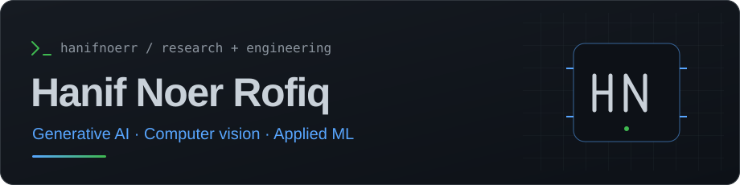
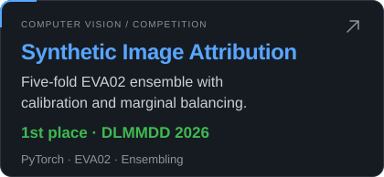
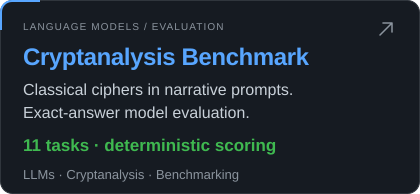
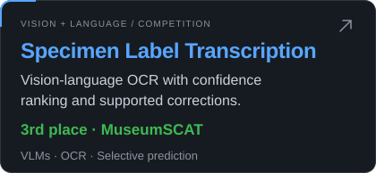
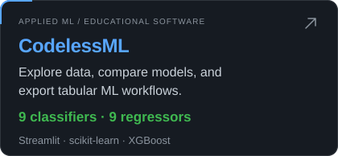

<h1 align="center">
  
</h1>

<h3 align="center">AI Engineer</h3>

Monash University · Melbourne, Australia

  <a href="https://hanifnoerr.github.io/">Portfolio</a> ·
  <a href="https://www.linkedin.com/in/hanifnoerr/">LinkedIn</a> ·
  <a href="https://orcid.org/0009-0004-0234-3055">ORCID</a> ·
  <a href="https://github.com/hanifnoerr">GitHub</a>

## About me

I am pursuing a **Master of Artificial Intelligence at Monash University**, researching generative AI and computer vision. I work on text-to-image diffusion models, efficient adaptation, and evaluation.

Previously, I worked as a **Data Analyst at Indonesia’s Ministry of Finance**, developing machine learning solutions, analytics dashboards, web applications, and digital systems.

**Research interests:** Generative AI · Computer vision & multimodal learning · LoRA & hypernetworks · AI benchmarking

## Featured work

  
  
  
  

<b>Project notes, results & research links</b>

- **[Synthetic Image Attribution](https://github.com/hanifnoerr/DLMMDD_solution):** Our 1st-place ICANN 2026 DLMMDD solution combines a five-fold EVA02-Large ensemble, temperature calibration, and test-time augmentation. The private-best submissions achieved **99.73% accuracy**. We study marginal balancing using the challenge’s known class composition. [Competition](https://www.kaggle.com/competitions/dlmmdd-workshop-synthetic-source-attribution-challenge).
- **[Cryptanalysis Benchmark](https://www.kaggle.com/benchmarks/hanifnoerrofiq/cipher-frontlines-story-driven-cryptanalysis):** I built **11 story-driven tasks** across classical cipher families. Models extract cipher rules from narrative clues and recover exact plaintext, with deterministic scoring and a growing public leaderboard.
- **[MuseumSCAT](https://github.com/hanifnoerr/museumscat-3rd-place-solution):** My 3rd-place solution combines vision-language transcription, confidence ranking, and selective, evidence-supported corrections to specimen dates and localities. The selected submission achieved a **private AURC of 0.00554**. [Reproduction guide](https://github.com/hanifnoerr/museumscat-3rd-place-solution/blob/main/docs/reproduction.md).
- **[CodelessML](https://github.com/hanifnoerr/CodelessML):** A Streamlit application for tabular data exploration, classification or regression model comparison, model export, and prediction workflows. Users upload CSV or Excel data and compare **nine algorithms per task**. [Journal article (2024)](https://dergipark.org.tr/en/pub/jcer/article/1506864).

## Selected achievements

| Year | Result | Work |
| :--- | :--- | :--- |
| 2026 | **1st place** | [ICANN DLMMDD Synthetic Image Attribution Challenge](https://github.com/hanifnoerr/DLMMDD_solution#official-results) |
| 2026 | **3rd place** | [MuseumSCAT Specimen Collection Annotation Task](https://github.com/hanifnoerr/museumscat-3rd-place-solution) |
| 2026 | **3rd place** | [Forams2026: detection and classification in micro-CT volumes](https://www.kaggle.com/competitions/forams-2026) |
| 2025 | **2nd place** | [Advent of MAPS 2025 Programming Challenge](https://github.com/hanifnoerr/MAPS_coding_challenges) |
| 2024 | **3rd place, team award** | [GovAI Hackathon: satellite imagery and carbon estimation](https://www.linkedin.com/posts/hanifnoerr_govai-hackathon-carbonpricing-activity-7270321100620734464-pRkU) |

## Tools I work with

  
  
  
  
  
  
  
  

**Programming & data:** Python, SQL, pandas, NumPy. **Machine learning:** PyTorch, scikit-learn, XGBoost, CatBoost. **Generative AI:** diffusion models, Transformers, LoRA, Hugging Face. **Development & research:** Git, Linux, Jupyter, Streamlit, LaTeX.

<b>GitHub activity & public-code languages</b>

  
  

Language proportions describe public repository code, including notebooks; they do not measure proficiency. These optional cards are provided by [GitHub Readme Stats](https://github.com/anuraghazra/github-readme-stats).

---

I welcome conversations about **generative AI, computer vision, personalisation, and applied machine learning**. Connect on [LinkedIn](https://www.linkedin.com/in/hanifnoerr/) or explore my [portfolio](https://hanifnoerr.github.io/).
